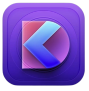

# SuiDS

> _**<ins>S</ins>**wift**<ins>UI</ins>** **<ins>D</ins>**esign **<ins>S</ins>**ystem_

## Demo

Soon!

## Tech Stack

- [SwiftUI](https://developer.apple.com/documentation/swiftui)

## Overview

SuiDS, **<span style="text-decoration: underline;">S</span>**wift**<span style="text-decoration: underline;">UI</span>** **<span style="text-decoration: underline;">D</span>**esign **<span style="text-decoration: underline;">S</span>**ystem, its a simple Design System to be used/implemented in your SwiftUI apps.

- `suids/*/*` - The project.

## Running Locally

This application requires **XCode 14.2.0**.

```bash
git clone https://github.com/samuelematias/suids.git
```

After cloned, open the project in your XCode.


## Cloning / Forking

Please review the [license](https://github.com/samuelematias/suids/blob/main/LICENSE.txt) and remove all of my personal information (docs, images, etc.).

## Author

<!-- prettier-ignore -->
<table>
  <tr>
    <td align="center"><a href="https://www.samuelematias.com/"><br /><sub><b>Samuel Matias</b></sub></a><br /><a href="https://www.linkedin.com/in/samuelematias/"title="Code">💻</a><a href="https://linktr.ee/samuelematias"title="Design"> 🎨</a></td></td>
</table>
